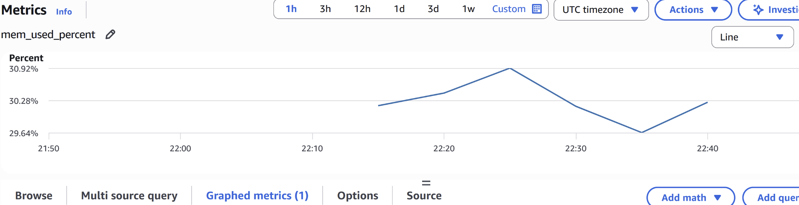
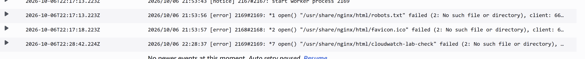
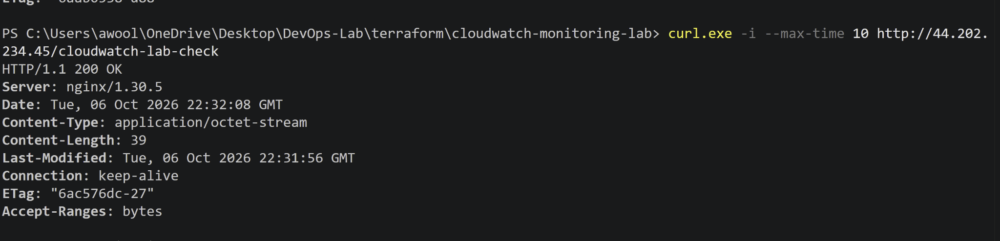
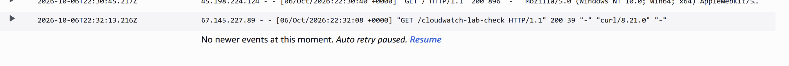
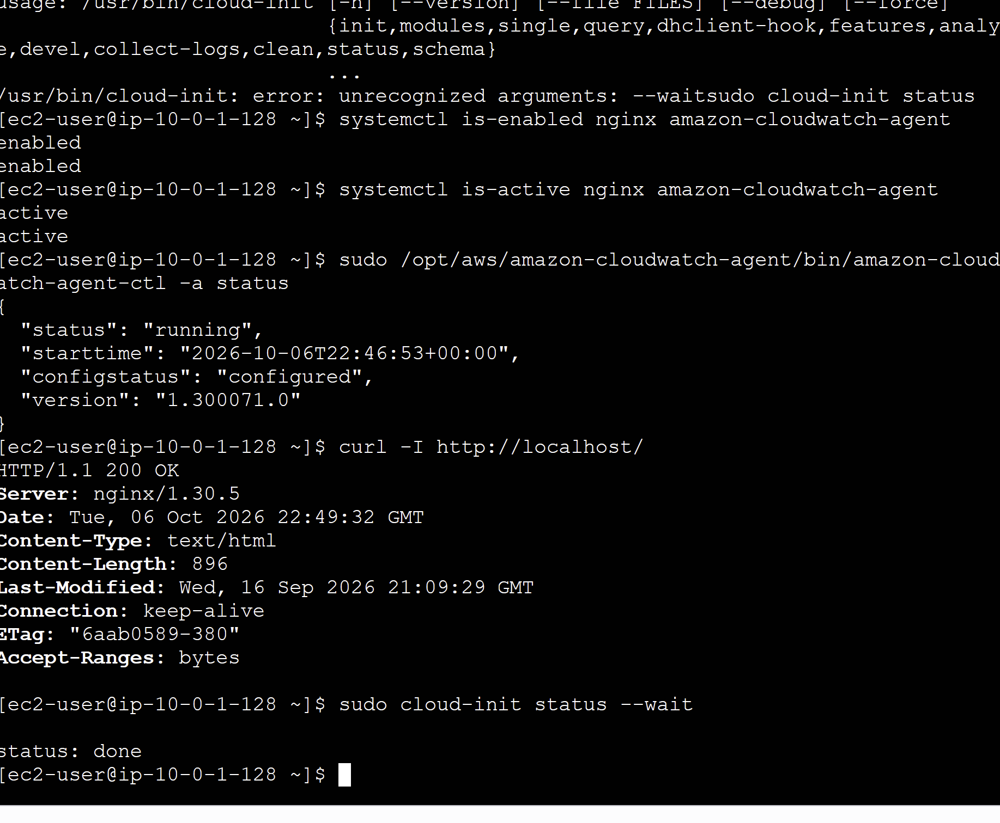
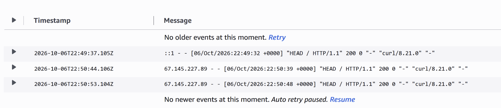
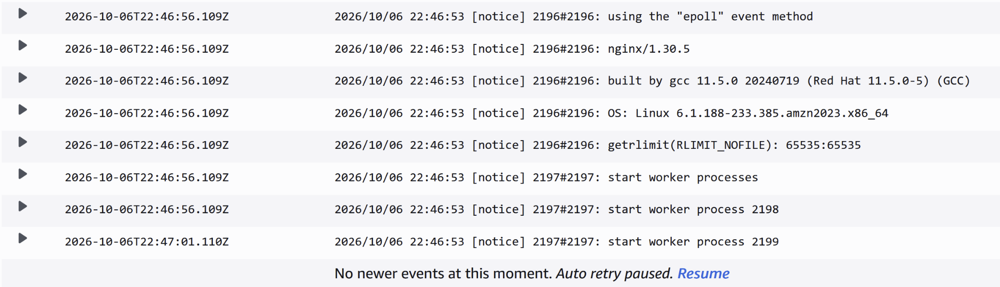

# AWS CloudWatch Monitoring Project

## Project Overview

This project demonstrates deploying AWS infrastructure using Terraform and configuring an EC2 instance to publish memory/disk metrics and NGINX logs to Amazon CloudWatch.

The goal of the project was to gain hands-on experience with Infrastructure as Code (IaC), IAM roles, EC2 provisioning, networking, and CloudWatch monitoring concepts used by Cloud Engineers, DevOps Engineers, and Site Reliability Engineers (SREs).

---

## Technologies Used

* AWS VPC
* AWS EC2
* AWS IAM
* AWS CloudWatch
* Terraform
* Amazon Linux 2023

## Local AWS Authentication with Provider 5.x

The root configuration locks the AWS provider to 5.100.0 within `~> 5.0`.
This version does not consume the `login_session` credentials created by
`aws login`, even when `aws sts get-caller-identity` succeeds with that profile.
Its fallback to EC2 IMDS on a workstation is a symptom of missing compatible
credentials, not a reason to enable an EC2 metadata endpoint locally.

For a console-login profile, a separate compatibility profile can be configured
in the Windows user's `.aws/config` (example names below):

```ini
[profile example-terraform]
credential_process = aws configure export-credentials --profile example-login --format process
region = us-east-1
```

This stores only a command, not credentials. Terraform invokes the AWS CLI to
resolve temporary credentials from the existing login session. Do not run the
export command on its own or paste its output into files or logs. Keep these
profiles separate to avoid a recursive credential process.

For this project's deployment checks, use the existing `cloudwatch-deploy` profile
from PowerShell in this top-level project directory (not `cloudwatch-rebuild`):

```powershell
$env:AWS_PROFILE = "cloudwatch-deploy"
aws sts get-caller-identity
terraform plan
```

Set the profile in the same terminal that runs Terraform. The provider remains
region-only and continues using the existing 5.x version. The AWS CLI must be
on PATH. Check `Get-Command terraform,aws` and AWS configuration-path environment
overrides when troubleshooting. Default Windows configuration is under
`%USERPROFILE%\.aws`; keep credentials and login caches outside this repository.

An earlier source login authenticated as root. Do not use a
root identity for deployments. Verify the intended non-root identity with
`get-caller-identity`; changing profile names alone does not change permissions.

See [AWS's credential-process compatibility instructions](https://docs.aws.amazon.com/cli/latest/userguide/cli-configure-sign-in.html).

---

## Architecture

The infrastructure consists of:

* Custom VPC
* Public Subnet
* Internet Gateway
* Route Table
* Security Group
* EC2 Instance
* IAM Role
* CloudWatch Agent Permissions

Traffic flows from the Internet through the VPC networking components to the EC2 web server. CloudWatch is used to collect monitoring data from the instance.

See the [architecture notes](docs/architecture.md), [operations runbook](docs/runbook.md),
and [lessons learned](docs/lessons-learned.md).

---

## Terraform Resources

### Networking

* VPC
* Public Subnet
* Internet Gateway
* Route Table
* Route Table Association

### Security

* Security Group allowing:

  * HTTP (Port 80)
  * SSH (Port 22)

### IAM

* IAM Role for EC2
* CloudWatchAgentServerPolicy
* Instance Profile

### Compute

* Amazon Linux 2023 EC2 Instance
* Dynamic AMI lookup using Terraform Data Sources

---

## Monitoring Objectives

The project was designed to monitor:

* CPU Utilization
* Memory Usage
* Disk Utilization
* Application Logs
* System Health Metrics

These metrics help engineers identify performance issues and troubleshoot production workloads.

## Verified Deployment and Manual Troubleshooting

On October 6, 2026, the original EC2 server was deployed locally with Terraform.
The CloudWatch agent was initially installed but unconfigured and inactive.
We manually configured and started it, then verified memory metrics and NGINX
access/error logs in CloudWatch.



*Original instance only: `mem_used_percent` after manual agent configuration.
This graph does not prove replacement-instance metrics or verified disk metrics.*

During troubleshooting, requesting `/cloudwatch-lab-check` returned HTTP 404.
CloudWatch's NGINX error logs identified a missing file. After we created the file
under `/usr/share/nginx/html`, the same request returned HTTP 200 in PowerShell, also recorded in
CloudWatch's access logs. This connected the HTTP symptom to the server-side error
and verified the correction through the collected logs. The check file was a
manual diagnostic change, not part of the automated deployment.



*The NGINX error log identifies `/usr/share/nginx/html/cloudwatch-lab-check` as missing.*



*The original server returned HTTP 200 after the file was created.*



*CloudWatch records `GET /cloudwatch-lab-check` with status 200, confirming the correction.*

## Automated Configuration and Fresh-Server Verification

After the manual checks, we automated configuration, startup, boot enablement,
and log permissions in Terraform `user_data`. We then replaced **only the EC2
instance** to test first-boot behavior on a fresh server; networking and IAM
resources were retained. Deployment and replacement were performed locally,
not through GitHub Actions.



*Fresh server: both services enabled/active, agent running/configured, localhost
HTTP 200, and cloud-init `status: done`. The screenshot also includes an earlier
accidentally concatenated command; the corrected cloud-init command succeeds below it.*



*Fresh server access logs contain successful `HEAD /` requests, including the localhost check.*



*The new server's error-log stream contains NGINX startup notices and worker-process
messages. These are normal startup notices, not evidence of an application error.*

The fresh-server evidence verifies bootstrap and log delivery. Memory metrics
were verified on the **original** instance only; new-instance memory metrics and
disk metrics remain separate verification tasks. No dashboard or alarms are implemented.

`cloudwatch-agent.json`, beside `main.tf`, defines:

| Setting | Value |
|---|---|
| Agent user / metric interval | `cwagent` / 60 seconds |
| Metrics namespace | `CWAgent` |
| Memory metric | `mem_used_percent` |
| Disk metric | `disk_used_percent` (configuration measurement `used_percent`, all disks) |
| EC2 dimensions | `ImageId`, `InstanceId`, `InstanceType`, `AutoScalingGroupName` |
| Access log | `/var/log/nginx/access.log` → `access.log` |
| Error log | `/var/log/nginx/error.log` → `error.log` |
| Both log streams | `{instance_id}` |
| Log group class / retention | `STANDARD` / 7 days |

`AutoScalingGroupName` is configured for instances belonging to an Auto Scaling
group; this standalone instance has no Auto Scaling group name to populate.
Seven-day retention applies to the entire named log group, including other
streams in that group. Existing log groups must already use STANDARD; the agent
cannot change an existing group's class.

On a new instance, `user_data` installs NGINX, the CloudWatch agent, and logrotate.
It adds `cwagent` to the `nginx` group, grants directory traversal and group read
access to the two log files, and configures rotation to retain those permissions.
Logs are not made world-readable. It writes the JSON to
`/opt/aws/amazon-cloudwatch-agent/etc/cloudwatch-agent.json`, loads it with
`amazon-cloudwatch-agent-ctl -a fetch-config -m ec2 -c file:... -s`, and enables
both services at boot. Credentials come from the instance role, not the files.

Terraform embeds the JSON with `file()` rather than `templatefile()`, and a
quoted shell heredoc prevents shell interpolation. Literal `${aws:...}` values
therefore reach the CloudWatch agent unchanged. Instance creation explicitly
depends on the public route-table association and CloudWatch IAM policy attachment;
the route table also depends on the internet gateway. The attached
`CloudWatchAgentServerPolicy` includes log retention permissions.

### Verification after an authorized deployment

On the instance, wait for cloud-init and inspect service and agent status:

```bash
sudo cloud-init status --wait
sudo systemctl is-enabled nginx amazon-cloudwatch-agent
sudo systemctl is-active nginx amazon-cloudwatch-agent
sudo /opt/aws/amazon-cloudwatch-agent/bin/amazon-cloudwatch-agent-ctl -a status
sudo -u cwagent test -r /var/log/nginx/access.log
sudo -u cwagent test -r /var/log/nginx/error.log
sudo logrotate --debug /etc/logrotate.d/nginx
```

Check `/var/log/cloud-init-output.log` for bootstrap failures and
`/opt/aws/amazon-cloudwatch-agent/logs/amazon-cloudwatch-agent.log` for agent errors.
In CloudWatch in `us-east-1`, verify recent `CWAgent` memory and disk metrics for
the instance. Generate an HTTP request and confirm a fresh event in its instance-ID
stream in `access.log`; a request for a nonexistent file can verify `error.log`.
Allow time for collection and delivery, and verify STANDARD class and 7-day retention.

### Existing-instance behavior and plan review

Before the replacement, the user-data-only plan proposed an in-place update.
A separately reviewed replacement plan selected only `aws_instance.web_server`
to test a fresh boot. The replacement was subsequently deployed locally and the
fresh-server results are shown above. The exact Terraform-rendered script had
also passed `bash -n` and embedded-JSON checks before deployment.

Updating EC2 `user_data` does **not** by itself guarantee cloud-init will rerun the
startup script. With the current AWS provider 5.x behavior and default
`user_data_replace_on_change = false`, a user-data-only update stops and starts
the existing instance rather than replacing it. Expect downtime and a possible
public IP change. A reboot alone does not normally rerun first-boot user data.
Reconfiguring an existing server requires a separately authorized configuration
update or an explicitly reviewed replacement. The historical replacement above
was deliberate; routine validation or publishing must not replace infrastructure.

The latest-AMI lookup can independently trigger replacement when Amazon publishes
a new matching image, so inspect every plan rather than assuming an in-place update.

References: [CloudWatch agent configuration](https://docs.aws.amazon.com/AmazonCloudWatch/latest/monitoring/CloudWatch-Agent-Configuration-File-Details.html),
[AWS provider 5.100.0 instance behavior](https://github.com/hashicorp/terraform-provider-aws/blob/v5.100.0/website/docs/r/instance.html.markdown).

---

## Key Terraform Concepts Demonstrated

* Resource Creation
* Variables
* Outputs
* IAM Role Attachments
* Data Sources
* Dynamic AMI Selection
* Infrastructure as Code Best Practices

---

## Security Considerations

For lab purposes, SSH access was configured using 0.0.0.0/0.

In a production environment, SSH access should be restricted to trusted IP addresses and administrative networks.

---

## Future Improvements

* Verify memory and disk metrics for the replacement instance
* Create CloudWatch Dashboards with Terraform
* Create CloudWatch Alarms with Terraform
* Implement GitHub Actions continuous deployment with appropriate approval controls
* Add remote Terraform state management

## CI and Deployment Status

The existing [Terraform Validation workflow](.github/workflows/terraform.yml)
runs `terraform fmt -check`, `terraform init -backend=false`, and
`terraform validate` on pushes to `main` and pull requests. It does not run
an AWS plan or deploy infrastructure. GitHub Actions CD is still pending;
the deployments described here were performed locally using `cloudwatch-deploy`.

For local validation, run from this top-level directory:

```powershell
$env:AWS_PROFILE = "cloudwatch-deploy"
terraform fmt -check
terraform validate
terraform plan
```

Saved plans, local state, credentials, and `.terraform` directories must not be
committed. The nested `cloudwatch-rebuild` workspace is outside this project's
documented deployment workflow.

The October 6, 2026 publication check used `cloudwatch-deploy`: the top-level
format check and validation passed, and the live Terraform plan reported
**No changes. Your infrastructure matches the configuration.** No infrastructure
was applied, replaced, or destroyed during this documentation/publication check.

---

## Lessons Learned

This project reinforced the importance of:

* Infrastructure automation
* IAM role management
* AWS networking fundamentals
* Monitoring and observability
* Terraform resource dependencies
* Cloud operational best practices
